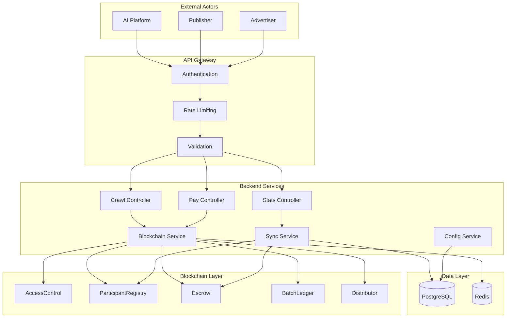
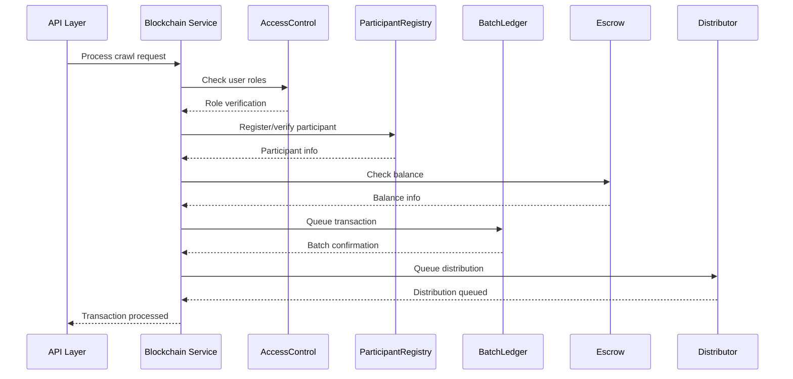

# Monowave MVP Architecture Documentation

This document provides a comprehensive overview of the Monowave MVP architecture, including system design, component interactions, data flows, and technical decisions.

## 📋 Table of Contents

- [System Overview](#system-overview)
- [Architecture Layers](#architecture-layers)
- [Component Diagram](#component-diagram)
- [Data Flow](#data-flow)
- [Technology Stack](#technology-stack)
- [Design Patterns](#design-patterns)
- [Scalability Considerations](#scalability-considerations)
- [Security Architecture](#security-architecture)

## 🌐 System Overview

Monowave MVP is a modular blockchain platform that enables AI platforms to access publisher content through transparent, automated settlement mechanisms. The system bridges traditional web services with blockchain technology to create a fair, efficient marketplace for AI content access.

### Core Value Propositions

1. **Transparent Pricing**: Blockchain-based cost calculation and settlement
2. **Automated Payments**: Smart contract-driven revenue distribution
3. **Scalable Processing**: Batch processing for high-frequency transactions
4. **Dispute Resolution**: Built-in mechanisms for handling conflicts
5. **Publisher Control**: Granular consent and pricing management

## 🏗️ Architecture Layers

### Layer 1: Blockchain Infrastructure

```
┌─────────────────────────────────────────────────────────────┐
│                     Base L2 Blockchain                      │
├─────────────────┬─────────────────┬─────────────────────────┤
│   Governance    │   Identity      │      Financial          │
│ PlatformTimelock│ AccessControl   │   TokenRegistry         │
│ ParticipantReg  │   BatchLedger   │     Distributor         │
│     Escrow      │ ProxyImporter   │      MockUSDC           │
└─────────────────┴─────────────────┴─────────────────────────┘
```

**Responsibilities:**
- Smart contract execution and state management
- Token transfers and escrow custody
- Role-based access control
- Immutable transaction logging
- Dispute resolution mechanisms

### Layer 2: Backend Services

```
┌─────────────────────────────────────────────────────────────┐
│                   Node.js Backend Services                  │
├─────────────────┬─────────────────┬─────────────────────────┤
│   Blockchain    │   Business      │      Data               │
│   Integration   │   Logic         │   Management            │
│                 │                 │                         │
│ blockchainSvc   │ adTransactionSvc│   configService         │
│ syncService     │ revenueService  │   Database Layer        │
│ Web3 Provider   │ billingService  │   Redis Cache           │
└─────────────────┴─────────────────┴─────────────────────────┘
```

**Responsibilities:**
- Web3 integration and contract interaction
- Business logic implementation
- Database operations and caching
- API endpoint implementation
- Background job processing

### Layer 3: API Gateway

```
┌─────────────────────────────────────────────────────────────┐
│                    Express.js API Layer                     │
├─────────────────┬─────────────────┬─────────────────────────┤
│   Controllers   │   Middleware    │      Routes             │
│                 │                 │                         │
│ crawlController │ authentication  │   /api/v1/crawl         │
│ payController   │ rateLimit       │   /api/v1/pay/*         │
│ statsController │ errorHandler    │   /api/v1/stats/*       │
│ adminController │ validation      │   /api/v1/admin/*       │
└─────────────────┴─────────────────┴─────────────────────────┘
```

**Responsibilities:**
- HTTP request handling
- Authentication and authorization
- Rate limiting and throttling
- Input validation and sanitization
- Response formatting

### Layer 4: Data Persistence

```
┌─────────────────────────────────────────────────────────────┐
│                    Data Persistence Layer                   │
├─────────────────┬─────────────────┬─────────────────────────┤
│   Primary DB    │   Cache Layer   │    Blockchain State     │
│                 │                 │                         │
│   PostgreSQL    │     Redis       │   Contract Storage      │
│   - Users       │   - Sessions    │   - Participant Info    │
│   - Transactions│   - Rate Limits │   - Escrow Balances     │
│   - Billing     │   - API Keys    │   - Batch Commitments   │
│   - MVP Tables  │   - Cache Data  │   - Distribution State  │
└─────────────────┴─────────────────┴─────────────────────────┘
```

**Responsibilities:**
- Persistent data storage
- Fast data retrieval and caching
- On-chain state management
- Data consistency and integrity

## 🔄 Component Diagram

### High-Level System Architecture



### Smart Contract Interaction Flow



## 📊 Data Flow

### 1. Crawl Request Flow

```
AI Platform Request
        ↓
   Authentication
        ↓
   Rate Limiting
        ↓
  Input Validation
        ↓
 Crawl Controller
        ↓
Blockchain Service
        ↓
Participant Check → Register if needed
        ↓
Balance Check → Auto-deposit if configured
        ↓
Content Processing
        ↓
Transaction Queuing (BatchLedger)
        ↓
Revenue Distribution Queuing
        ↓
Response to AI Platform
```

### 2. Batch Processing Flow

```
Queued Transactions
        ↓
Batch Aggregation (configurable size/time)
        ↓
Merkle Tree Generation
        ↓
Batch Commitment (BatchLedger)
        ↓
Payout Opening (Distributor)
        ↓
User Notification (optional)
        ↓
Claim Processing (user-initiated)
```

### 3. Payment Settlement Flow

```
User Deposit Request
        ↓
Token Validation (TokenRegistry)
        ↓
Limit Checking
        ↓
Escrow Deposit
        ↓
Balance Update
        ↓
Distribution Processing
        ↓
Merkle Proof Generation
        ↓
Claim Execution
        ↓
Fund Transfer
```

## 🛠️ Technology Stack

### Blockchain Layer
- **Smart Contracts**: Solidity ^0.8.25
- **Framework**: Hardhat for development and testing
- **Proxy Pattern**: UUPS (Universal Upgradeable Proxy Standard)
- **Access Control**: OpenZeppelin AccessControl
- **Network**: Base L2 (Coinbase Layer 2)
- **Tokens**: ERC20 stablecoins (USDC)

### Backend Layer
- **Runtime**: Node.js 18+
- **Framework**: Express.js 4.x
- **Web3 Integration**: Web3.js
- **Database**: PostgreSQL 14+
- **Cache**: Redis 6+
- **Testing**: Jest + Hardhat

### Infrastructure
- **Process Management**: PM2
- **Logging**: Winston
- **Monitoring**: Custom metrics + health checks
- **Rate Limiting**: Redis-based sliding window
- **Authentication**: JWT + API keys

### Development Tools
- **Version Control**: Git
- **Package Manager**: npm
- **Linting**: ESLint
- **Code Formatting**: Prettier
- **CI/CD**: GitHub Actions (configurable)

## 🎯 Design Patterns

### 1. Proxy Pattern (Smart Contracts)

**Implementation**: UUPS (Universal Upgradeable Proxy Standard)

```solidity
// Proxy deployment pattern
contract MyContract is Initializable, UUPSUpgradeable {
    function initialize() public initializer {
        // Initialization logic
    }
    
    function _authorizeUpgrade(address newImplementation) 
        internal 
        override 
        onlyRole(GOVERNOR_ROLE) 
    {}
}
```

**Benefits**:
- Upgradeable contracts without losing state
- Gas-efficient deployment
- Centralized upgrade control

### 2. Repository Pattern (Backend)

**Implementation**: Service layer abstraction

```javascript
class BlockchainService {
    constructor(web3Provider, contractAddresses) {
        this.web3 = web3Provider;
        this.contracts = this.initializeContracts(contractAddresses);
    }
    
    async getParticipantInfo(address) {
        // Abstract blockchain interaction
    }
}
```

**Benefits**:
- Separation of concerns
- Testability with mocking
- Technology-agnostic business logic

### 3. Factory Pattern (Contract Deployment)

**Implementation**: Standardized contract deployment

```javascript
class ContractFactory {
    static async deployWithProxy(contractName, initArgs) {
        const implementation = await this.deployImplementation(contractName);
        const proxy = await this.deployProxy(implementation, initArgs);
        return this.getContractInstance(contractName, proxy.address);
    }
}
```

**Benefits**:
- Consistent deployment process
- Reduced deployment complexity
- Standardized initialization

### 4. Observer Pattern (Event Handling)

**Implementation**: Smart contract event monitoring

```javascript
class EventMonitor {
    constructor(contracts) {
        this.setupEventListeners(contracts);
    }
    
    setupEventListeners(contracts) {
        contracts.batchLedger.events.BatchCommitted()
            .on('data', this.handleBatchCommitted.bind(this));
    }
}
```

**Benefits**:
- Real-time system updates
- Decoupled component communication
- Scalable event processing

### 5. Strategy Pattern (Payment Processing)

**Implementation**: Multiple payment strategies

```javascript
class PaymentProcessor {
    constructor() {
        this.strategies = {
            'escrow': new EscrowPaymentStrategy(),
            'direct': new DirectPaymentStrategy(),
            'batch': new BatchPaymentStrategy()
        };
    }
    
    processPayment(type, amount, options) {
        return this.strategies[type].process(amount, options);
    }
}
```

**Benefits**:
- Flexible payment methods
- Easy addition of new strategies
- Clean separation of payment logic

## 📈 Scalability Considerations

### 1. Horizontal Scaling

**Database Scaling**:
- Read replicas for query distribution
- Connection pooling for efficient resource usage
- Database partitioning by user or time

**Application Scaling**:
- Stateless service design
- Load balancer distribution
- Microservice decomposition potential

### 2. Blockchain Scalability

**Batch Processing**:
- Merkle tree aggregation reduces on-chain transactions
- Configurable batch sizes based on network conditions
- Off-chain computation with on-chain verification

**Layer 2 Optimization**:
- Base L2 for reduced gas costs
- Optimistic rollup benefits
- Fast finality for better UX

### 3. Caching Strategy

**Multi-Level Caching**:
```
Application Cache (In-Memory)
        ↓
Redis Cache (Distributed)
        ↓
Database Cache (PostgreSQL)
        ↓
Blockchain State (Immutable)
```

**Cache Invalidation**:
- Event-driven cache updates
- TTL-based expiration
- Manual invalidation for critical updates

### 4. Performance Optimization

**Database Optimization**:
- Indexed queries for common access patterns
- Materialized views for complex aggregations
- Prepared statements for repeated queries

**API Optimization**:
- Response compression
- Pagination for large datasets
- Asynchronous processing for heavy operations

## 🔐 Security Architecture

### 1. Authentication & Authorization

**Multi-Layer Security**:
```
API Key Authentication
        ↓
Rate Limiting
        ↓
Role-Based Access Control
        ↓
Smart Contract Permissions
        ↓
Blockchain Transaction Validation
```

### 2. Smart Contract Security

**Security Measures**:
- OpenZeppelin battle-tested contracts
- Reentrancy guards on all state-changing functions
- Access control modifiers
- Emergency pause functionality
- Timelock for critical operations

**Audit Trail**:
```solidity
event SecurityEvent(
    address indexed actor,
    string action,
    bytes32 indexed reference,
    uint256 timestamp
);
```

### 3. Data Protection

**Sensitive Data Handling**:
- API key hashing with bcrypt
- Database encryption at rest
- TLS encryption in transit
- Private key management (HSM recommended)

**Privacy Considerations**:
- Minimal data collection
- GDPR compliance mechanisms
- User consent management
- Data retention policies

### 4. Operational Security

**Monitoring & Alerting**:
- Real-time security event monitoring
- Anomaly detection for unusual patterns
- Automated incident response
- Security audit logging

**Disaster Recovery**:
- Database backup strategies
- Smart contract upgrade procedures
- Emergency response protocols
- Business continuity planning

## 🔄 Deployment Architecture

### Development Environment
```
Developer Machine
        ↓
Local Hardhat Network
        ↓
Local PostgreSQL/Redis
        ↓
Jest/Hardhat Testing
```

### Staging Environment
```
Staging Server
        ↓
Base Sepolia Testnet
        ↓
Staging Database
        ↓
Integration Testing
```

### Production Environment
```
Production Cluster
        ↓
Base Mainnet
        ↓
Production Database (HA)
        ↓
Monitoring & Alerting
```

### CI/CD Pipeline
```
Code Commit
        ↓
Automated Testing
        ↓
Security Scanning
        ↓
Staging Deployment
        ↓
Integration Testing
        ↓
Production Deployment
        ↓
Post-Deployment Verification
```

## 📊 Monitoring & Observability

### Application Metrics
- Request/response times
- Error rates and types
- Database query performance
- Cache hit/miss ratios
- API usage patterns

### Blockchain Metrics
- Transaction confirmation times
- Gas usage optimization
- Contract interaction success rates
- Batch processing efficiency
- Network congestion impact

### Business Metrics
- User acquisition and retention
- Revenue per transaction
- Settlement success rates
- Dispute resolution times
- Platform utilization rates

---

**Monowave MVP Architecture** - Scalable, secure, and efficient blockchain infrastructure for AI content authorization and advertising settlement.
