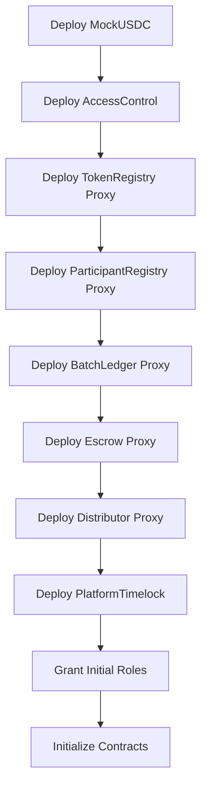

# Monowave MVP Deployment Guide

This guide covers deploying the Monowave MVP architecture with the new modular smart contracts.

## 📋 Prerequisites

1. **Node.js** (v18 or higher)
2. **PostgreSQL** (v12 or higher)
3. **Redis** (v6 or higher)
4. **Git**

## 🔧 Environment Setup

### 1. Clone and Install Dependencies

```bash
git clone <repository-url>
cd Monowave
npm install
```

### 2. Environment Configuration

```bash
# Copy the environment template
cp env.template .env

# Edit .env with your configuration
nano .env
```

Required environment variables:
- `DATABASE_URL` - PostgreSQL connection string
- `REDIS_URL` - Redis connection string
- `PRIVATE_KEY` - Deployer private key
- `BASE_SEPOLIA_RPC_URL` - Base Sepolia RPC endpoint
- `BASESCAN_API_KEY` - For contract verification

### 3. Database Setup

```bash
# Run database migrations for MVP
npm run migrate:mvp

# Set up initial database structure
npm run setup:mvp
```

## 🚀 Smart Contract Deployment

### Local Development

```bash
# Start local Hardhat network
npm run node

# Deploy to local network (in another terminal)
npm run deploy:localhost

# Run post-deployment operations
npm run post-deploy
```

### Base Sepolia Testnet

```bash
# Deploy MVP contracts
npm run deploy:base-sepolia

# Run post-deployment setup
npm run post-deploy:base-sepolia

# Verify contracts on Basescan
npm run verify:base-sepolia
```

### Base Mainnet

```bash
# Deploy MVP contracts
npm run deploy:base

# Verify contracts
npm run verify:all
```

## 📝 Deployment Scripts Overview

### Core Deployment Scripts

| Script | Purpose | Network Support |
|--------|---------|----------------|
| `deployMvp.js` | Deploy all MVP contracts with UUPS proxies | All networks |
| `postDeployOps.js` | Initial setup and configuration | All networks |
| `verifyAll.js` | Verify contracts on block explorers | Testnet/Mainnet |

### MVP Contract Architecture

The deployment creates the following contracts:

1. **AccessControl** - Role-based access control
2. **ParticipantRegistry** - Unified participant management
3. **TokenRegistry** - Whitelisted tokens and limits
4. **Escrow** - Fund custody and accounting
5. **BatchLedger** - Batch transaction commitment
6. **Distributor** - Revenue distribution with Merkle claims
7. **PlatformTimelock** - Governance timelock
8. **MockUSDC** - Test token (testnet only)

### Deployment Flow



## 🔄 Post-Deployment Operations

After deployment, run the post-deployment script to:

1. **Configure TokenRegistry** - Whitelist USDC and set limits
2. **Mint Test Tokens** - For testnet environments
3. **Fund Escrow** - Initial deposits for testing
4. **Commit Test Batch** - Verify BatchLedger functionality
5. **Open Test Payout** - Verify Distributor functionality
6. **Execute Test Claim** - End-to-end verification

```bash
npm run post-deploy:base-sepolia
```

## 🧪 Testing Deployment

### Run MVP Contract Tests

```bash
# Test all MVP contracts
npm run test:contracts:mvp

# Test specific contract
npx hardhat test contracts/test_mvp/BatchLedger.test.js --config contracts/hardhat.config.js
```

### Backend Integration Tests

```bash
# Test backend services with new contracts
npm run test:mvp

# Test database migrations
npm run test:unit:current
```

## 📊 Monitoring and Verification

### Contract Verification

Contracts are automatically verified during deployment. Manual verification:

```bash
# Verify all contracts
npm run verify:all

# Verify specific contract
npx hardhat verify --network baseSepolia <CONTRACT_ADDRESS> <CONSTRUCTOR_ARGS>
```

### Monitor Deployment

Use the monitoring script to track contract events:

```bash
# Monitor contract events in real-time
npx hardhat run contracts/scripts/monitor.js --network baseSepolia
```

## 🔐 Security Considerations

### Access Control

- **DEFAULT_ADMIN_ROLE**: Contract deployer (transfer after setup)
- **GOVERNOR_ROLE**: Platform governance operations
- **SETTLER_ROLE**: Settlement and dispute resolution
- **LEDGER_ROLE**: Batch commitment operations
- **TREASURER_ROLE**: Escrow fund management
- **RISK_ROLE**: Risk management and limits

### Upgradeability

All core contracts use UUPS (Universal Upgradeable Proxy Standard):
- Upgrades require `GOVERNOR_ROLE`
- Timelock protection for critical upgrades
- Storage gap preservation for future versions

### Operational Security

1. **Private Key Management**: Use hardware wallets for mainnet
2. **Role Distribution**: Distribute roles across multiple addresses
3. **Timelock Configuration**: Set appropriate delays for governance
4. **Monitoring**: Set up alerts for critical events

## 🔄 Migration from Legacy

### For Existing Deployments

If migrating from the legacy architecture:

1. **Deploy New MVP Contracts** (this guide)
2. **Migrate Database Schema** (`npm run migrate:mvp`)
3. **Update Backend Services** (already done in codebase)
4. **Test Integration** (`npm run test:mvp`)
5. **Gradual Migration** (run both systems in parallel)
6. **Legacy Cleanup** (after full migration)

### Legacy Script Access

Legacy deployment script is available as:
```bash
npm run deploy:legacy
```

## 📚 Additional Resources

- **Contract Documentation**: `contracts/README.md`
- **API Documentation**: `src/README.md`
- **Test Status**: `TEST_STATUS_MVP.md`
- **Environment Template**: `env.template`

## 🆘 Troubleshooting

### Common Issues

1. **Gas Estimation Failed**
   - Check network connectivity
   - Verify account has sufficient funds
   - Increase gas limit in hardhat.config.js

2. **Contract Verification Failed**
   - Verify API key configuration
   - Check constructor arguments
   - Ensure contract is deployed and confirmed

3. **Database Connection Issues**
   - Verify DATABASE_URL format
   - Check PostgreSQL service status
   - Run `npm run migrate:mvp` to update schema

4. **Role Permission Errors**
   - Verify deployer has necessary roles
   - Check AccessControl role assignments
   - Review contract initialization

### Getting Help

- Check `TEST_STATUS_MVP.md` for current test status
- Review deployment logs for specific error messages
- Verify environment variable configuration
- Test on local network first before mainnet deployment
